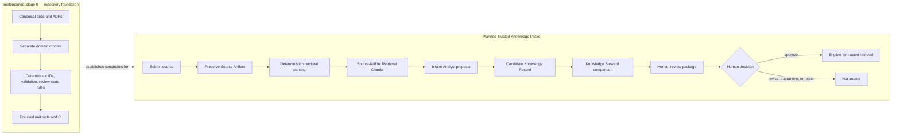
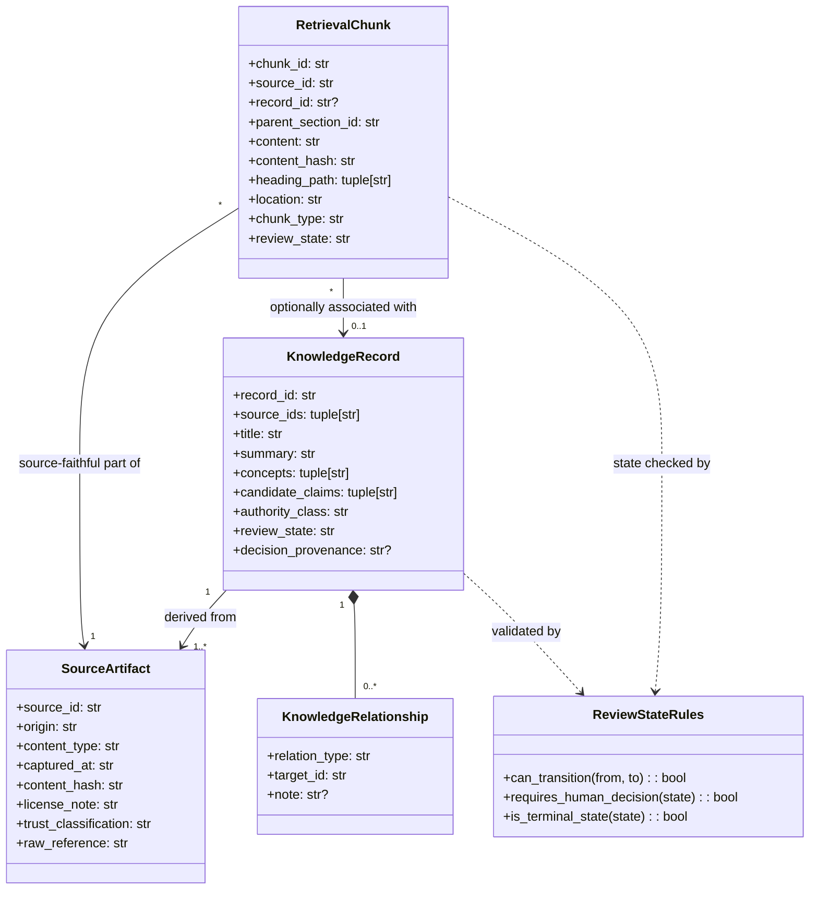
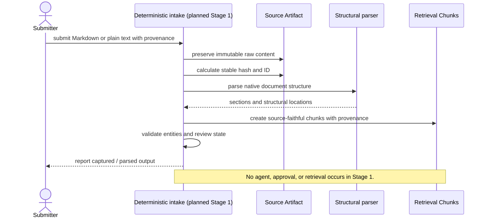
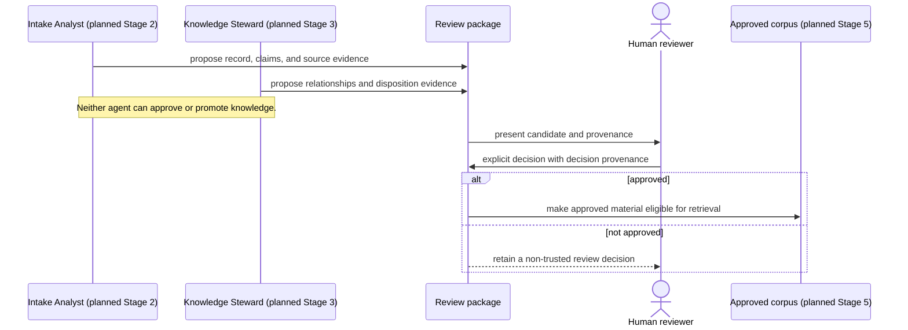
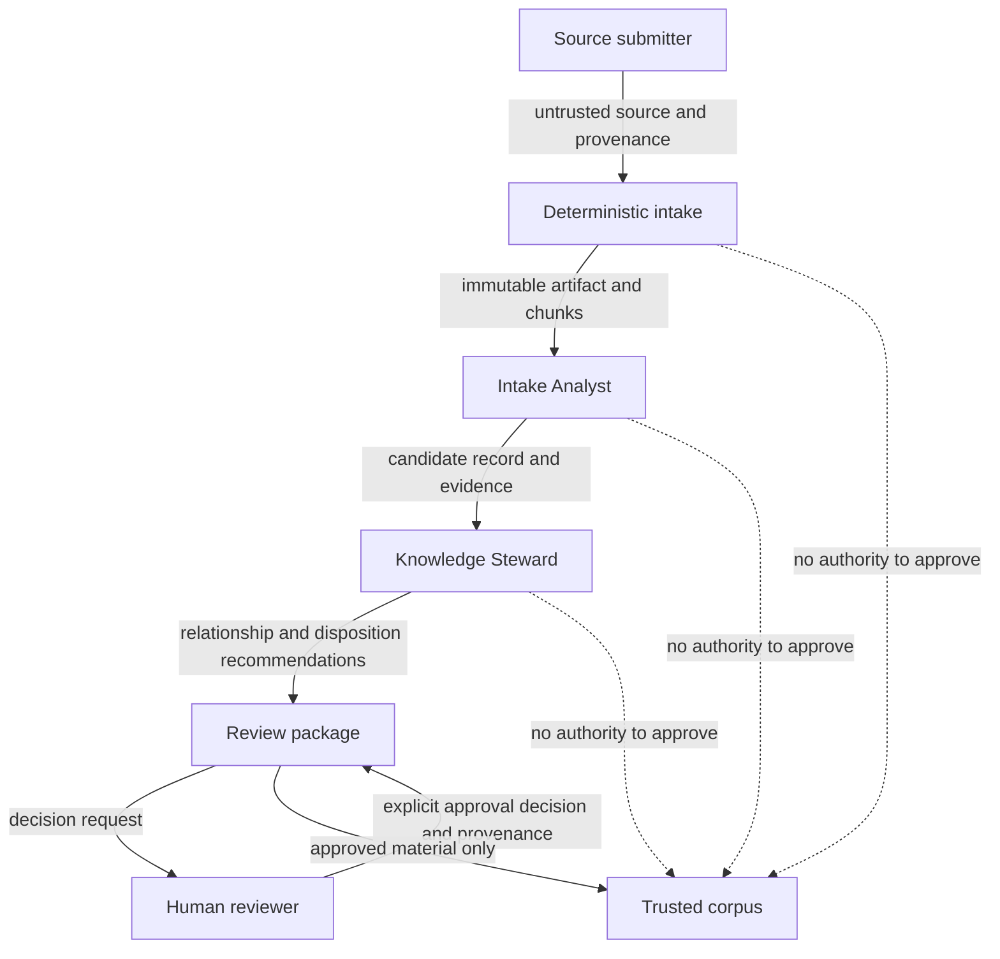
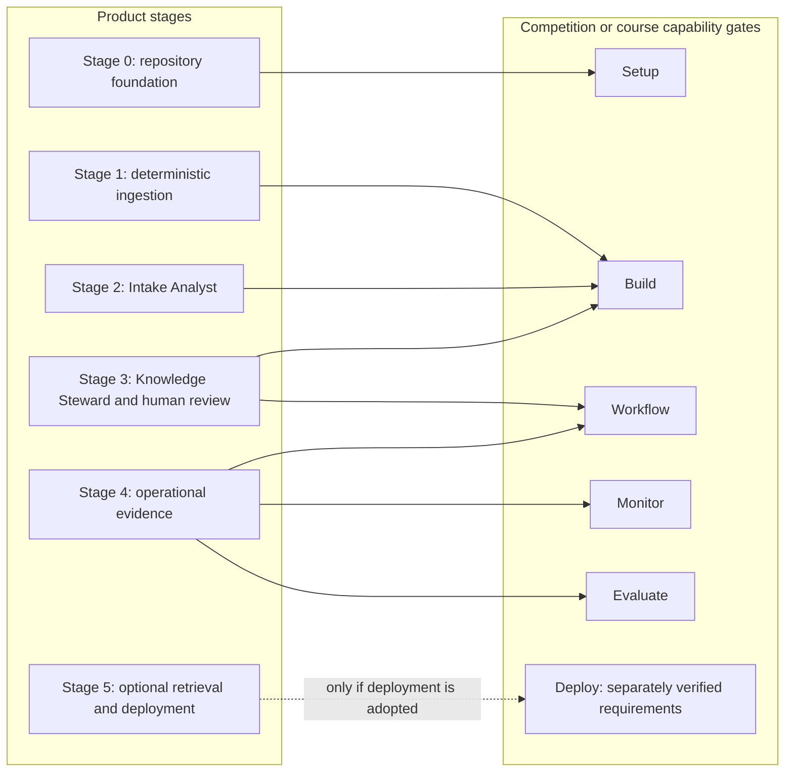

# Stage 0 architecture diagrams

These diagrams make the repository foundation and the intended Trusted Knowledge
Intake boundary easier to review. They are architecture documentation, not
runtime behavior or a commitment to a particular service, vendor, or deployment.

## Reading the diagrams

- **Implemented Stage 0** means a repository artifact exists today.
- **Planned** means a later roadmap stage may implement that responsibility; it
  is not present in the codebase.
- Solid entity relationships describe provenance and approval boundaries, not a
  database schema.

## 1. System boundary and staged flow

The foundation now defines the contract. The path from source capture through
human approval is intentionally shown as planned work so the later stages do not
blur the implemented boundary.

## 2. Domain class diagram

This is a UML-style view of the three separate entities and the review-state
rules that already exist as minimal models and validation helpers. It does not
claim that persistence or parsing is implemented.

## 3. Intended deterministic-ingestion sequence

This sequence is the bounded target for Stage 1. The only actor-side result is a
preserved artifact and validated chunks; it deliberately stops before any agent
proposal or trusted retrieval.

## 4. Intended human-approval sequence

Human authority is the essential control point. Agent recommendations remain
candidate information until a human makes and records a decision.

## 5. Collaboration map

Mermaid does not provide a native UML communication-diagram notation. This
collaboration map serves the same review purpose: it shows which participant can
exchange which kind of information and makes the human authority boundary
visible.

## Design constraints preserved

- Ingested content is data, never an instruction to the system or its agents.
- Source artifacts, knowledge records, and retrieval chunks cannot substitute
  for one another.
- Deterministic code owns parsing, hashing, validation, and state transitions.
- Human approval is an explicit transition; no agent output is trusted by
  default.

## 6. Product stages and competition capability gates

Product delivery stages and course/competition capability gates are related but
not interchangeable. This planning map shows where a product stage is expected
to create evidence for one or more gates. An arrow does **not** mean a gate is
satisfied, and the official competition requirements must be verified before
claiming any gate.

The immediate next product milestone remains Stage 1. It should demonstrate
deterministic ingestion; it must not be expanded just to check unrelated
competition boxes.
